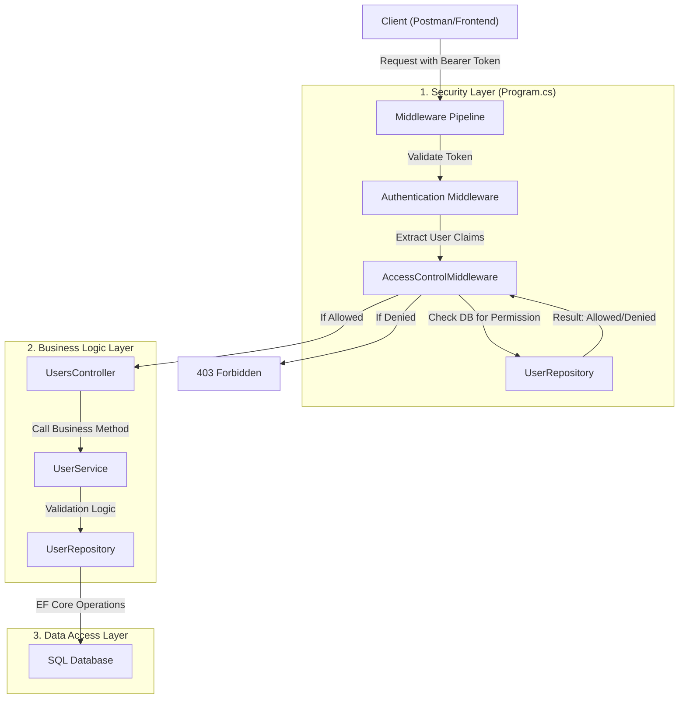
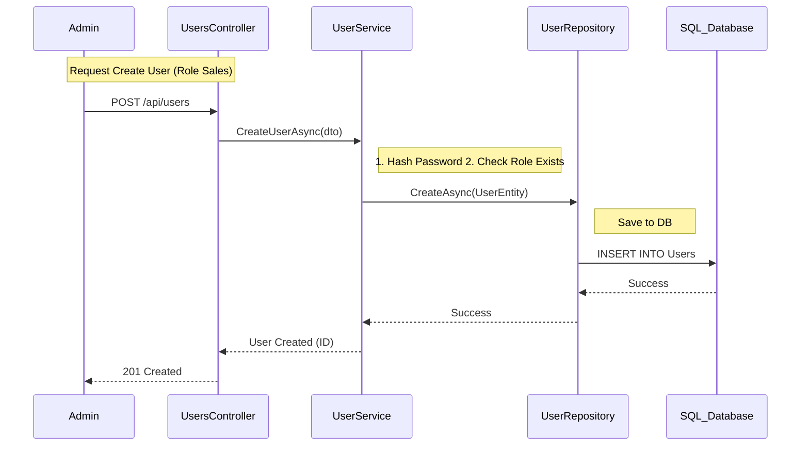
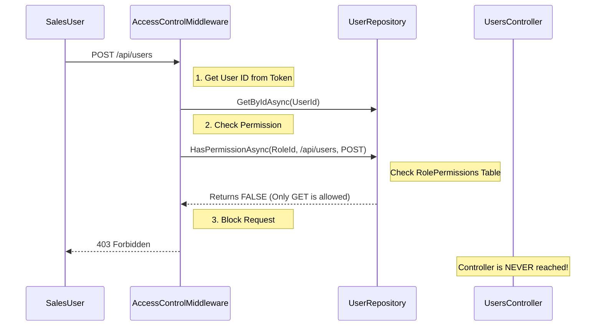

# MyERP Identity Service Architecture

Yeh document poore **User Management** aur **Role-Based Access Control (RBAC)** flow ko explain karta hai. Humne **Modular Architecture** use kiya hai taaki har cheez (Auth, User, Role, Permission) alag-alag manage ho sake.

## High-Level Flow (Request Life Cycle)

Jab koi request (e.g., `POST /api/users`) aati hai, toh woh in layers se guzarti hai:

## Detailed Component Breakdown

### 1. Security Layer (Sabse Pehle)
**File:** `src/MyERP.Services.Identity/Middleware/AccessControlMiddleware.cs`

Yeh humara **Custom Security Guard** hai. Har request controller tak pahunchne se pehle yahan check hoti hai.

*   **Logic:**
    1.  **Check 1**: User Logged In hai? (JwtBearer Token check).
    2.  **Check 2**: User ka `RoleId` DB se fetch karta hai.
    3.  **Check 3**: DB mein `RolePermissions` table check karta hai:
        *   Kya is Role ko `ApiEndpoint` (e.g., `/api/users`) aur `HttpMethod` (e.g., `POST`) allowed hai?
        *   Kya `IsGranted == true` hai?
    4.  Agar **Yes** -> Request Controller par jaati hai.
    5.  Agar **No** -> `403 Forbidden` wapas bhej deta hai.

### 2. Controllers (API Entry Point)
**Files:**
*   `UsersController.cs`: User Create/Update/Delete ke liye.
*   `RolesController.cs`: Roles manage karne ke liye.
*   `PermissionsController.cs`: Permissions grant/revoke karne ke liye.

Yeh sirf **Traffic Cops** hain. Yeh request lete hain, data validate karte hain (via DTOs), aur `Service` ko kaam saomp dete hain.

### 3. Services (The Brain)
**Files:**
*   `UserService.cs`: User creation logic, filtering active users (`IsActive`), mapping DTO to Entity.
*   `RoleService.cs`: Role creation logic, default values set karna (`IsActive = true`).
*   `PermissionService.cs`: Permissions assign karne ka logic.

Yahan humara main business logic hota hai. Example: "Agar naya user ban raha hai, toh password hash karo aur default settings lagao."

### 4. Repository (The Data Keeper)
**File:** `UserRepository.cs` (Implementation of `IUserRepository`)

Yeh sirf Database se baat karta hai using **Entity Framework Core**.
*   **Create/Update**: DB mein save karta hai.
*   **Soft Delete**: Record delete karne ke bajaye `IsActive = false` set karta hai.
*   **HasPermissionAsync**: Yeh woh function hai jo Middleware use karta hai permission check karne ke liye.

---

## Specific Flow: Assigning Role & Creating User

Jab aap ek naya User banate hain aur Role assign karte hain (`POST /api/users`), toh yeh flow chalta hai:

## Specific Flow: Permission Check (The Fix)

Jab `SalesUser` (`GET /api/users` allowed) galti se `POST /api/users` try karta hai:

